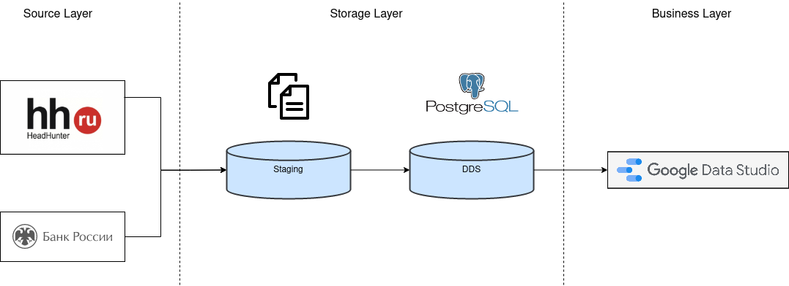
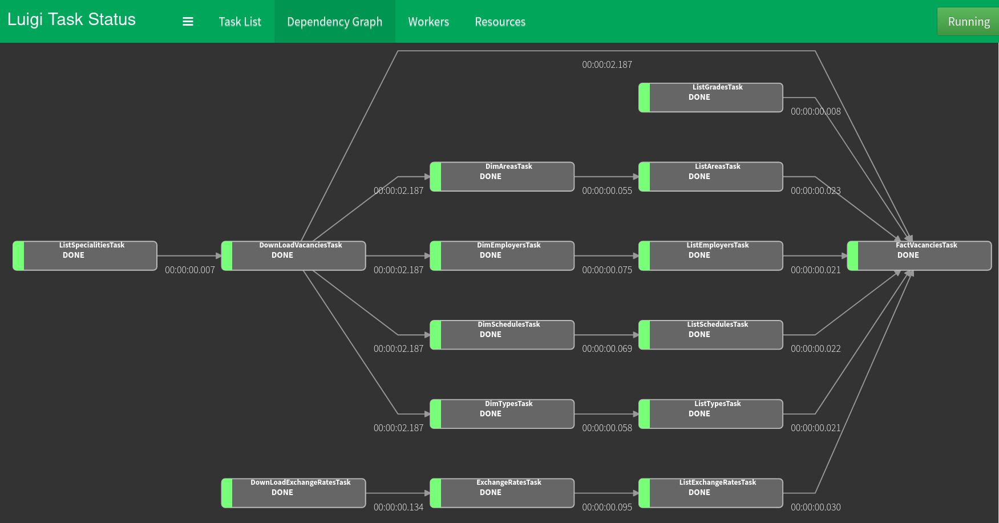
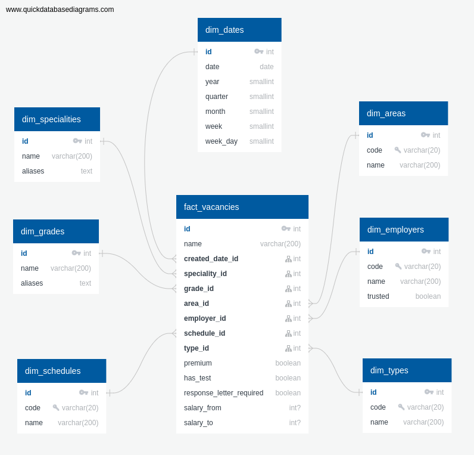
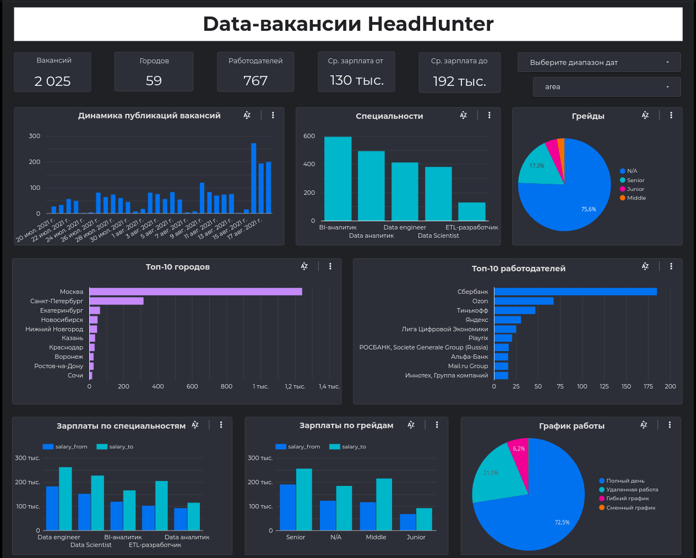

# Data-вакансии HeadHunter'а
         
Глобальная цель всего проекта - создать витрину данных для анализа вакансий data-специальностей [HeadHunter'а](https://hh.ru/).

## Архитектура Аналитического Решения

### Source layer
В качестве источника данных в первую очередь выступает [API HeadHunter'а](https://github.com/hhru/api/blob/master/docs/vacancies.md#search).

Параметры поиска:
* `area` – регион = Россия
* `date_from`, `date_to` – даты, которые ограничивают диапазон дат публикации вакансий. По умолчанию ограничиваемся одним вчерашним днем
* `search_field` – область поиска = только заголовок
* `text` – текст поиска. Ищем по любому из синонимов специальностей, сохраненных в базе, используя [язык поисковых запросов](https://hh.ru/article/1175)

Т.к. зарплаты некоторых специальностей указываются в валюте, отличной от рубля, необходимо знать курс валют на момент публикации вакансии. Для этого используется [API Центрального Банка России](http://www.cbr.ru/development/SXML/).

### Storage Layer
Для оркестрации процесса используется [фреймворк Luigi](https://luigi.readthedocs.io). [Задачи](./tasks) формируют граф зависимостей:

#### Staging                
Данные с HeadHunter грузятся последовательно по всем специальностям постранично и сохраняются в _csv-файлы_.

Курсы валют Центробанка сохраняются как есть в виде _xml-файлов_.

#### DDS
Данные из файлов переносятся в _PostgreSQL_-базу, которая организована в виде звезды:

Подробное описание полей можно посмотреть [здесь](schema/README.md).

### Business Layer
Для построения [дашборда](https://datastudio.google.com/s/hWPoRL-dNMo) используется _Google Data Studio_.

